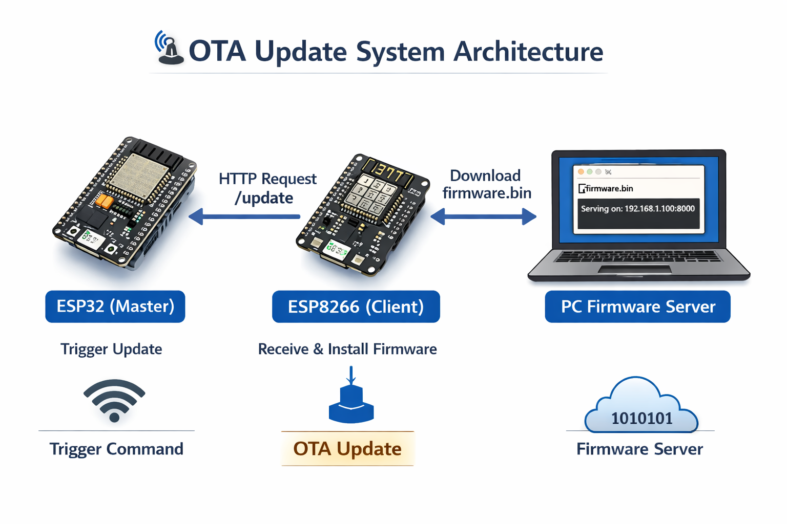
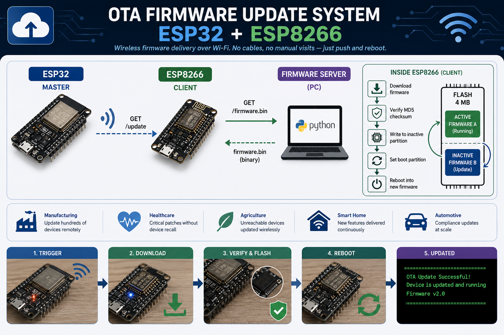

# OTA Firmware Update System ESP32 + ESP8266

This project implements an Over-The-Air (OTA) firmware update system for IoT devices. Instead of physically plugging a USB cable into every device to update its software, this system lets you push new firmware wirelessly — over Wi-Fi — to any number of devices on your network.

Think of it like your phone downloading a software update in the background. The device updates itself, reboots, and runs the new version — all without you touching it

---

# Why This Matters in Real Life

Imagine you have 500 temperature sensors deployed in a factory. A bug is discovered in the firmware. Without OTA, you would need to physically visit each device, plug in a cable, and flash it. That takes weeks and costs a fortune.

With OTA, you push a fix from your laptop in minutes — all 500 devices update themselves overnight


----

# Mon projet



<<<<<<< HEAD
----
=======
<div align="center">



</div>

---

## Why OTA Matters

Imagine 500 temperature sensors deployed across a factory floor. A critical bug is discovered in the firmware. Without OTA, every device requires a physical visit, a USB cable, and a manual flash — weeks of work and significant cost.

**With this system, you push a fix from your laptop. All 500 devices update overnight.**

| Industry | Use Case | Impact |
|---|---|---|
| Manufacturing | Sensor networks, PLCs | Update hundreds of devices remotely |
| Healthcare | Patient monitors, wearables | Critical patches without device recall |
| Agriculture | Remote soil / weather sensors | Unreachable devices updated wirelessly |
| Smart Home | Thermostats, locks, cameras | New features delivered continuously |
| Automotive | EV chargers, fleet trackers | Regulatory compliance updates at scale |

---

## Architecture


### How It Works

| Step | Actor | Action |
|:---:|---|---|
| 1 | ESP32 | Connects to Wi-Fi, spawns a FreeRTOS trigger task on Core 1 |
| 2 | ESP32 | Sends `GET /update` to the ESP8266 every 10 seconds until accepted |
| 3 | ESP8266 | Receives the request, replies `200 OK` immediately |
| 4 | ESP8266 | Downloads `firmware.bin` from the PC server in chunks |
| 5 | ESP8266 | Verifies the MD5 checksum and writes to the OTA partition |
| 6 | ESP8266 | Updates the boot pointer and reboots into the new firmware |

### Why the Dual-Partition Flash Is Safe

The ESP8266 holds two firmware partitions in its 4 MB flash. The running firmware is **never overwritten** — new firmware is written to the inactive partition and only activated after MD5 verification passes. A failed download or power cut leaves the original firmware fully intact, so the device can never be bricked mid-update.

---

## Project Structure

```
ota-esp32-esp8266/
├── esp32-master/               # ESP32 — OTA trigger master
│   ├── platformio.ini          # Board: esp32dev, framework: arduino
│   └── src/
│       └── main.cpp            # FreeRTOS task, HTTPClient trigger
│
├── esp8266-client/             # ESP8266 — OTA client
│   ├── platformio.ini          # Board: nodemcuv2 (or d1_mini)
│   └── src/
│       └── main.cpp            # WebServer + ESPhttpUpdate
│
├── firmware-v2/                # New firmware to push via OTA
│   ├── platformio.ini
│   └── src/
│       └── main.cpp            # Prints "Firmware v2.0..." after update
│
├── firmware-server/            # Served by a Python HTTP server
│   └── README.md               # Instructions for binary deployment
│
├── .gitignore                  # Excludes .pio/, *.bin, .vscode/
└── README.md
```

---

## Tech Stack

| Layer | Technology | Role |
|---|---|---|
| Hardware | ESP32 (Xtensa LX6, dual-core, 240 MHz) | Trigger master |
| Hardware | ESP8266 (Xtensa LX106, 80 MHz) | OTA client, 4 MB flash |
| RTOS | FreeRTOS | Task scheduling on ESP32 Core 1 |
| Network | lwIP / TCP-IP / 802.11 | Wi-Fi transport layer |
| Protocol | HTTP/1.1 | Trigger + firmware delivery |
| Framework | Arduino via PlatformIO | Hardware abstraction |
| Library | ESP8266WebServer | HTTP server on ESP8266 |
| Library | ESP8266httpUpdate | OTA flash management |
| Library | HTTPClient (ESP32) | HTTP GET trigger |
| Server | Python `http.server` | Static firmware file serving |

---

## Requirements

### Hardware

| Component | Example | Purpose |
|---|---|---|
| ESP32 dev board | ESP32-WROOM-32 DevKit v1 | Master trigger |
| ESP8266 dev board | NodeMCU v2 or Wemos D1 Mini | OTA client |
| 2× USB cables | Micro-USB | Initial flashing only |
| PC on same Wi-Fi network | Windows / macOS / Linux | Firmware server |

### Software

- [VS Code](https://code.visualstudio.com/) + [PlatformIO IDE extension](https://platformio.org/)
- Python 3 (`python3 --version` to verify)
- Git

---

## Configuration

Before flashing, update these variables in each source file:

| File | Variable | Set To |
|---|---|---|
| `esp32-master/src/main.cpp` | `WIFI_SSID` | Your Wi-Fi network name |
| `esp32-master/src/main.cpp` | `WIFI_PASSWORD` | Your Wi-Fi password |
| `esp32-master/src/main.cpp` | `ESP8266_IP` | IP printed by the ESP8266 on the Serial Monitor |
| `esp8266-client/src/main.cpp` | `WIFI_SSID` | Your Wi-Fi network name |
| `esp8266-client/src/main.cpp` | `WIFI_PASSWORD` | Your Wi-Fi password |
| `esp8266-client/src/main.cpp` | `FIRMWARE_URL` | `http://YOUR_PC_IP:8000/firmware.bin` |

**Find your PC's IP address:**
```bash
# Linux / macOS
hostname -I

# Windows
ipconfig    # look for 192.168.x.x
```

---

## Getting Started

Follow these steps in order. Each sub-project is opened independently in VS Code/PlatformIO.

### Step 1 — Build the new firmware binary

```
Open firmware-v2/ in VS Code
→ PlatformIO: Build  (Ctrl+Alt+B)
→ Output: .pio/build/nodemcuv2/firmware.bin
```

Copy the binary to the server folder:
```bash
# Linux / macOS
cp firmware-v2/.pio/build/nodemcuv2/firmware.bin firmware-server/firmware.bin

# Windows (PowerShell)
copy firmware-v2\.pio\build\nodemcuv2\firmware.bin firmware-server\firmware.bin
```

### Step 2 — Start the firmware HTTP server

```bash
cd firmware-server
python3 -m http.server 8000
```

Verify it works — open `http://YOUR_PC_IP:8000/firmware.bin` in your browser. It should download.

> Leave this terminal running for the entire session.

### Step 3 — Flash the ESP8266 client

```
Open esp8266-client/ in VS Code
→ Edit src/main.cpp: set WIFI_SSID, WIFI_PASSWORD, FIRMWARE_URL
→ PlatformIO: Upload  (Ctrl+Alt+U)
→ Open Serial Monitor at 115200 baud
→ Note the IP address printed:  [ESP8266] IP: 192.168.x.x  ← copy this
```

### Step 4 — Flash the ESP32 master

```
File → New Window in VS Code
→ Open esp32-master/
→ Edit src/main.cpp: set WIFI_SSID, WIFI_PASSWORD, and paste the ESP8266 IP into ESP8266_IP
→ PlatformIO: Upload
→ Open Serial Monitor at 115200 baud
```

### Step 5 — Watch it work

Switch to the ESP8266 Serial Monitor. You should see:

```
[ESP8266] Received GET /update — starting OTA...
[ESP8266] Download started...
[ESP8266] Progress: 10%
...
[ESP8266] Progress: 100%
[ESP8266] Download complete. Rebooting...

============================
  OTA Update Successful!
  Device is updated and running
  Firmware v2.0
============================
```

---

## Troubleshooting

| Symptom | Cause | Fix |
|---|---|---|
| ESP32 response code `-1` | Wrong ESP8266 IP | Check the ESP8266 Serial Monitor for its actual IP |
| `Update FAILED` on ESP8266 | Wrong PC IP or server not running | Run `python3 -m http.server 8000` and verify `firmware.bin` is in the folder |
| `firmware.bin` 404 error | Binary not copied to `firmware-server/` | Build `firmware-v2` and copy the `.bin` file |
| Serial shows garbled text | Wrong baud rate | Set the Serial Monitor to exactly `115200` |
| Board not detected (Windows) | Missing USB driver | Install the [CP210x](https://www.silabs.com/developers/usb-to-uart-bridge-vcp-drivers) or [CH340](https://sparks.gogo.co.nz/ch340.html) driver |
| ESP8266 flashes every 10s in a loop | No version check | Add a `CURRENT_VERSION` guard in `handleUpdate()` |

---

## Future Improvements

- **Digital signature verification** in addition to MD5, to guard against a compromised firmware server, not just corrupted downloads
- **HTTPS** instead of plain HTTP for the firmware transfer, to prevent man-in-the-middle tampering
- **Rollback on boot failure** — automatically revert to the previous partition if the new firmware fails to boot within N attempts

---

## Author

**Ala Eddine Derbel** — *Embedded Systems Engineer*
>>>>>>> 4f82dadacfca478abf870ac898aa2e5c29832620
